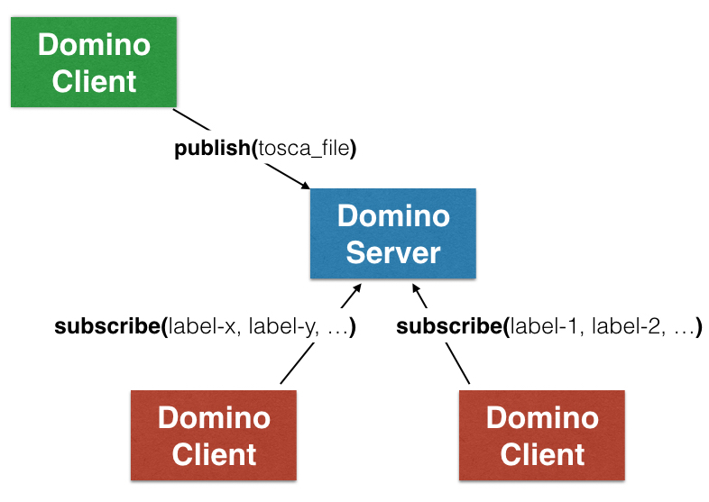

.. This work is licensed under a Creative Commons Attribution 4.0 International License.
.. http://creativecommons.org/licenses/by/4.0

==================
Domino Description
==================

Domino provides a distribution service for Network Service Descriptors (NSDs) and
Virtual Network Function Descriptors (VNFDs) that are composed using Tosca Simple
Profile for Network Functions Virtualization
(http://docs.oasis-open.org/tosca/tosca-nfv/v1.0/tosca-nfv-v1.0.html).
Domino service is targeted towards supporting many Software Defined Network (SDN) controllers,
Service Orchestrators (SOs), VNF Managers (VNFMs), Virtual Infastructure Managers (VIMs),
Operation and Business Support Systems that produce and/or consume NSDs and VNFDs.

Producers of NSDs and VNFDs use Domino Service through Service Access Points (SAPs) or End Points (EPs)
to publish these descriptors. Consumers of NSDs and VNFDs subscribe with the Domino Service through
the same SAPs/EPs and declare their resource capabilities to onboard and perform Life Cycle Management
(LCM) for Network Services (NSs) and Virtual Network Functions (VNFs). Thus, Domino acts as a service
broker for NSs and VNFs modeled in a Tosca template.

=============================
Domino Capabilities and Usage
=============================

Labels in Domino
================

Domino's pub/sub architecture is based on labels (see Fig. 1 below).
Each Template Producer and Template Consumer is expected to run a local Domino Client
to publish templates and subscribe for labels.

.. _fig-label:

    Domino provides a pub/sub server for NSDs and VNFDs

Domino Service does not interpret what the labels mean. Domino derives labels directly from
the normative definitions in TOSCA Simple YAML Profile for NFV. Domino parses the policy
rules included in the NSD/VNFD, form "policy" labels, and determine which resources are
associated with which set of labels. Domino identifies which Domino Clients can host
which resource based on the label subscriptions by these clients. Once mapping of resources
to the clients are done, new NSDs/VNFDs are created based on the mapping. These new
NSDs/VNFDs are translated and delivered to the clients.

Label Format and Examples
=========================

Domino supports policy labels in the following form:

.. code-block:: bash

  <policytype>:properties:<key:value>

Orchestrators, controllers, and managers use Domino service to announce their
capabilities by defining labels in this form and subscribing for these labels with
the Domino Server.

For instance a particular VIM that is capable of performing an
affinity based VNF or VDU placement at host machine granularity can specify a label
in the form:

.. code-block:: bash

  tosca.policies.Placement.affinity:properties:granularity:hostlevel

When the VIM registers with the Domino Service and subscribed for that label, Domino views
this VIM as a candidate location that can host a VNF or VDU requesting affinity based
placement policy at host machine granularity.

Another use case is the announcement of lifecycle management capabilities for VNFs and
VNF Forwarding Graphs (VNFFG) by different SDN Controllers (SDN-Cs), VNFMs, or VIMs.
For instance

.. code-block:: bash

  tosca.policies.Scaling.VNFFG:properties:session_continuity:true

can be used as a label to indicate that when a scaling operation on a VNFFG (e.g., add
more VNFs into the graph) is requested, existing session can still be enforced to go
through the same chain of VNF instances.

To utilize Domino's domain mapping services for virtual network resources (e.g., VNF, VDU,
VNFFG, CP, VL, etc.), a network service or network function request must include
policy rules that are composed of policy types and property values that match to the
label announcements made by these domains. For instance, when a TOSCA template includes a
policy rule with type "tosca.policies.Scaling.VNFFG" and property field
"session_continuity" set as "true" targeting one or more VNFFGs, this serves as the hint
for the Domino Server to identify all the Domain Clients that subscribed the label
"tosca.policies.Scaling.VNFFG:properties:session_continuity:true".

Template Example for Label Extraction
=====================================

Consider the following NSD TOSCA template:

.. code-block:: bash

  tosca_definitions_version: tosca_simple_profile_for_nfv_1_0_0
  description: Template for deploying a single server with predefined properties.
  metadata:
    template_name: TOSCA NFV Sample Template
  policy_types:
    tosca.policies.Placement.Geolocation:
      description: Geolocation policy
      derived_from: tosca.policies.Placement
  topology_template:
    node_templates:
      VNF1:
        type: tosca.nodes.nfv.VNF
        properties:
          id: vnf1
          vendor: acmetelco
          version: 1.0
      VNF2:
        type: tosca.nodes.nfv.VNF
        properties:
          id: vnf2
          vendor: ericsson
          version: 1.0
      VNF3:
        type: tosca.nodes.nfv.VNF
        properties:
          id: vnf3
          vendor: huawei
          version: 1.0
    policies:
      - rule1:
          type: tosca.policies.Placement.Geolocation
          targets: [ VNF1 ]
          properties:
            region: [ us-west-1 ]
      - rule2:
          type: tosca.policies.Placement.Geolocation
          targets: [ VNF2, VNF3 ]
          properties:
            region: [ us-west-1 , us-west-2 ]

Domino Server extracts all possible policy labels by exhaustively concatenating key-value
pairs under the properties section of the policy rules to the policy type of these rules:

.. code-block:: bash

  tosca.policies.Placement.Geolocation:properties:region:us-west-1
  tosca.policies.Placement.Geolocation:properties:region:us-west-2

Furthermore, Domino Server iterates over the targets specified under policy rules to generate a set of labels for each target node:

.. code-block:: bash

  required_labels['VNF1'] = { tosca.policies.Placement.Geolocation:properties:region:us-west-1 }
  required_labels['VNF2'] = { tosca.policies.Placement.Geolocation:properties:region:us-west-1 , tosca.policies.Placement.Geolocation:properties:region:us-west-2}
  required_labels['VNF3'] = { tosca.policies.Placement.Geolocation:properties:region:us-west-1 , tosca.policies.Placement.Geolocation:properties:region:us-west-2}

When a Template Consuming site (e.g., VNFM or VIM) registers with the Domino Server using
Domino Client, it becomes an eligible candidate for template distribution with an initially
empty set of label subscriptions. Suppose three different Domino Clients register with the
Domino Server and subscribe for some or none of the policy labels such that the Domino Server
has the current subscription state as follows:

.. code-block:: bash

  subscribed_labels[site-1] = { } #this is empty set
  subscribed_labels[site-2] = { tosca.policies.Placement.Geolocation:properties:region:us-west-1 }
  subscribed_labels[site-3] = { tosca.policies.Placement.Geolocation:properties:region:us-west-1 ,  tosca.policies.Placement.Geolocation:properties:region:us-west-2}

Based on the TOSCA example and hypothetical label subscriptions above, Domino Server identifies
all the VNFs can be hosted by Site-3, while VNF1 can be hosted by both Site-2 and Site-3.
Note that Site-1 cannot host any of the VNFs listed in the TOSCA file. When a VNF can be hosted
by multiple sites, Domino Server picks the site that can host the most number of VNFs. When not
all VNFs can be hosted on the same site, the TOSCA file is partitioned into multiple files, one
for each site. These files share a common part (e.g, meta-data, policy-types, version,
description, virtual resources that are not targeted by any policy rule, etc.). Each site
specific file has also a non-common part that only appears in that file (i.e., virtual
resources explicitly assigned to that site and the policy rules that accompany those virtual
resources.

In the current Domino convention, if a VNF (or any virtual resource) does not have a policy
rule (i.e., it is not specified as a target in any of the policy rules) and it also is not
dependent on any VNF (or any virtual resource) that is assigned to another site, that resource
is wild carded by default and treated as part of the "common part". Also note that currently
Domino does not support all or nothing semantics: if some of the virtual resources are not
mappable to any domain because they are targets of policy rules that are not supported by any
site, these portions will be excluded while the remaining virtual resources will be still be
part of one or more template files to be distributed to hosting sites. When NSDs and VNFDs are
prepared, these conventions must be kept in mind. In the future releases, these conventions can
change based on the new use cases.

For the example above, no partitioning would occur as all VNFs are mapped onto site-3;
Domino Server simply delivers the Tosca file to Domino Client hosted on site-3. When TOSCA
cannot be consumed by a particular site directly, Domino Server can utilize
existing translators (e.g., heat-translator) to first translate the template before delivery.

Internal Processing Pipeline at Domino Server
=============================================

Fig. 2 shows the block diagram for the processing stages of a published TOSCA template.
Domino Client issues an RPC call publish(tosca file). Domino Server passes the received tosca
file to Label Extractor that outputs resource labels. Domain Mapper uses the extracted labels
and tosca file to find mappings from resources to domains as well as the resource dependencies.
Resource to domain mappings and resource dependencies are utilized to partition the
orchestration template into individual resource orchestration templates (one for each domain).
If a translation is required (e.g., TOSCA to HOT), individual resource orchestration templates
are first translated and then placed on a template distribution workflow based on resource
dependencies. Message Sender block in the server takes one distribution task at a time from the
workflow generator and pushes the orchestration template to the corresponding Domino Client.

.. _fig-pipe:

.. figure:: ../../etc/domino_server_processing.png
    :width: 400px
    :align: center
    :height: 350px
    :alt: alternate text
    :figclass: align-center

    Domino Service Processing Pipeline

Resource Scheduling
===================

Domino Service currently supports maximum packing strategy when a  virtual resource type can
be hosted on multiple candidate sites. Initially, Domino Scheduler identifies virtual resources
that has only one feasible site for hosting. Each such virtual resource is trivially assigned
to its only feasible site. The remaining virtual resources with multiple candidate locations
are sequentially allocated to one of their candidate locations that has the most virtual
resource assignments so far. Note that wildcarded resources are assigned to all sites. To
prevent wildcarding within the current release, (i) all sites must subscribed to a base policy
with a dummy key-value pair defined under the properties tab and (ii) all the independent
resources must be specified as target of that policy in NSD or VNFD file.
