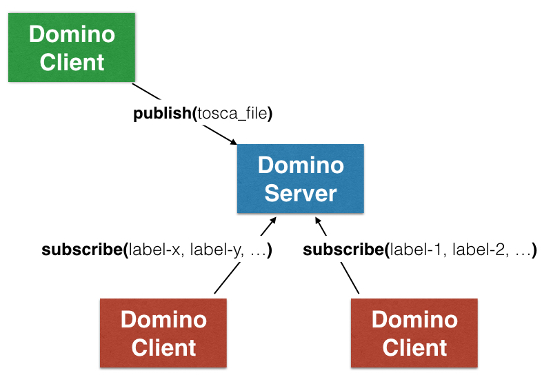

.. This work is licensed under a Creative Commons Attribution 4.0 International License.
.. http://creativecommons.org/licenses/by/4.0

.. image:: ../etc/opnfv-logo.png
  :height: 40
  :width: 200
  :alt: OPNFV
  :align: left
.. these two pipes are to seperate the logo from the first title
|
|
Domino Overview
===============
Domino provides a distribution service for Network Service (NS) and Virtual
Network Function (VNF) descriptors. It is targeted towards supporting many
network controllers, service orchestrators, VNF managers, Operation and
Business Support Systems. Producers of Network Service Descriptors (NSDs)
and VNF Descriptors (VNFD) use Domino Service as an entry point to publish
these descriptors. Currently Domino only supports Tosca Simple Profile for
Network Functions Virtualization (http://docs.oasis-open.org/tosca/tosca-nfv/v1.0/tosca-nfv-v1.0.html) as the data model for NSDs and VNFDs.

Orchestrators, controllers, and managers use Domino service to announce their
capabilities in the form of policy labels. For instance a Virtual Infrastructure
Manager (VIM) that is capable of performing an affinity based VNF or VDU
placement at host machine granularity can specify a label in the form "tosca.policies.Placement.affinity:properties:granularity:hostlevel". When the VIM registers
with Domino Service and subscribed for that label, Domino views this VIM as a
candidate location that can host a VNF or VDU requesting affinity based placement
policy at host machine granularity. Another use case is the announcement of
lifecycle management capabilities for VNFs and VNF Forwarding Graphs (VNFFG) by
different SDN Controllers (SDN-Cs), VNF Managers (VNFMs), or VIMs. For instance
"tosca.policies.Scaling.VNFFG:properties:session_continuity:true" can be used as
a label to indicate that when a scaling operation on a VNFFG (e.g., add more VNFs
into the graph) is requested, existing session can still be enforced to go
through the same chain of VNF instances. To utilize this capability, a network
service request then must include a policy type definition "tosca.policies.Scaling.VNFFG"
with a property field "session_continuity" as well as a policy rule that sets
this field to boolean value "true" and specify a list of VNFFGs as the targets.

Labels in Domino
================
Domino's pub/sub architecture is based on labels (see :numref:`fig-label` below).
Each Template Producer and Template Consumer is expected to run a local Domino Client
to publish templates and subscribe for labels.

.. _fig-label:

    Domino provides a pub/sub server for NSDs and VNFDs
